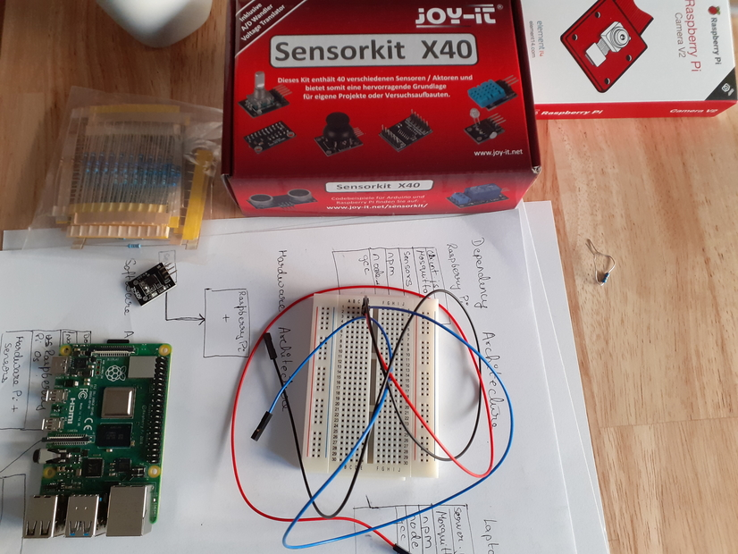
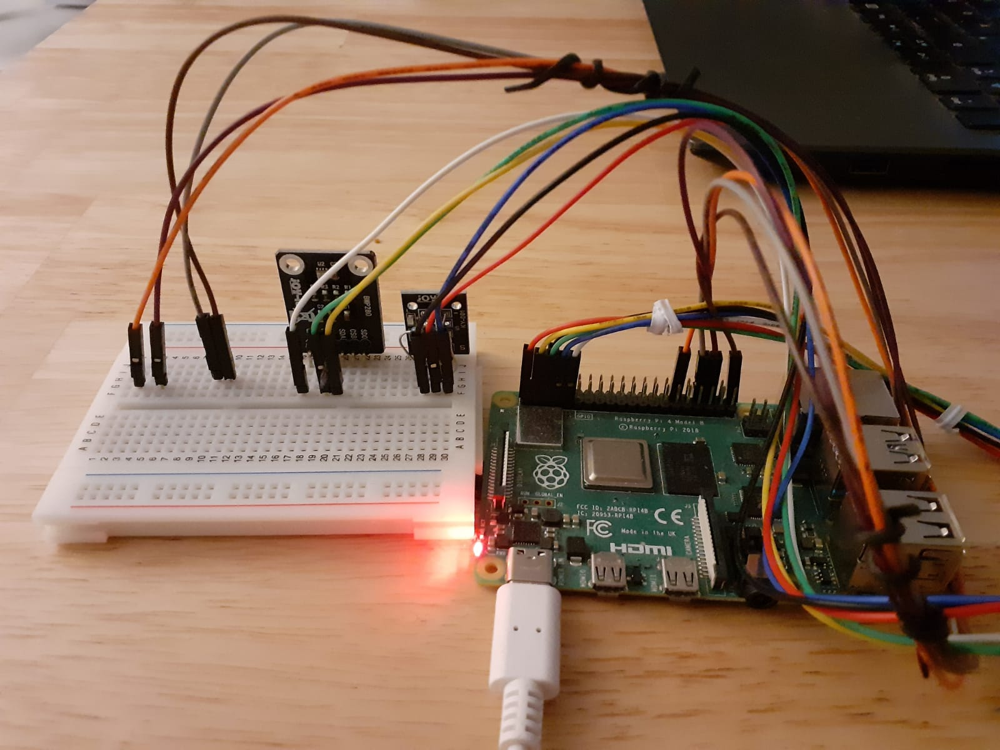
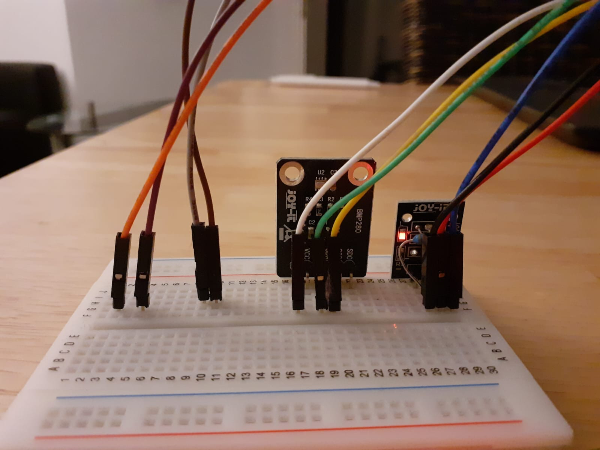
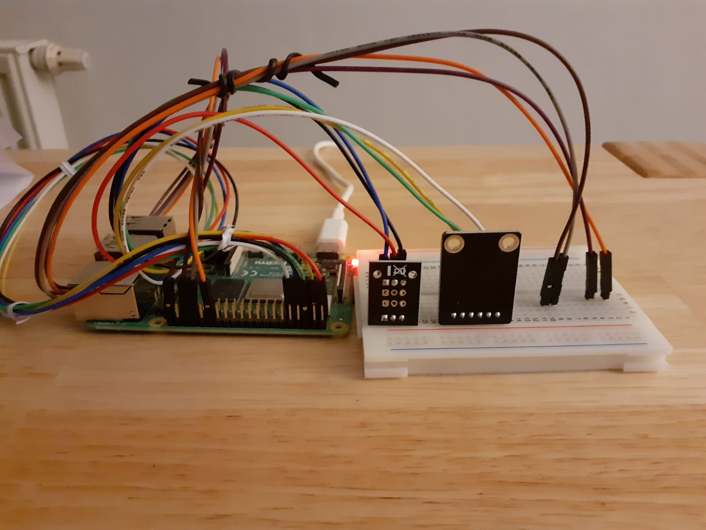

## This is the client side set up for IoT Weather Station
### Step 1: Set up Raspberry Pi
* Flash Raspberry Pi OS on an SD Card
* Check if RPI is working and functional

### Step 2: Configure Raspberry PI GPIO Pins
Run the following commands on raspberry pi
```
 $ sudo vim /boot/config.txt
```
* Add `dtoverlay=w1-gpio` on the last line of the file
```
 sudo reboot
```
* login again on to your RPI


### Step 3: Set up hardware
* Look at the images provides to attach temperature sensor to RPI 
* All Components for the project: 

* Setup  (connected components)

* Close up of sensor connection: front view

* Close up of sensor connection: rear view


### Step 4: Get the data from the device files
Run the following commands
```
cd /sys/bus/w1/devices && ls
cd 28-XXXXXXXXXXX (where xxx is the file number you will see with ls)
cat temperature (this will print the temperature on terminal)
```

### Step 5 Docker Image with all dependencies including jenkins
* To build the docker image from the dockerfile run the following:
	```
  docker build -t <name-of-image> . 
  ```
  '.' refers to path to the docker file here assumed that docker file is in current directory

* To run the docker image making sure the volume having jenkins state (p/w's , plugins etc.)
  persisted run the (new) docker container as
	```
  docker run --network="host" -v jenkins:/var/jenkins_home -it --name=<name-of-container> <name-of-image> bash
  ```

* To run the docker container such that the jenkins data and settings are persisted across different docker containers, first cretae a volume and then mount. 
* To create the volume first run 
  `jenkins volume  create jenkins`
  where the last token, `jenkins` in the command above is the name of the volume where all the jenkins  data is stored and  persisted

* After creating the volume run the docker container by using:
  ```
  docker run --network="host" -it --mount source=jenkins,target=/var/jenkins_home -v /sys/bus/w1/devices/28-00000b65fafc:/sys/bus/w1/devices/28-00000b65fafc --name=as_rpi1 rpi2:latest bash
  ```
  Note: the flag `-v` informs jenkins to attach the `path\to\sensor\data\on\rpi:as\path\to\sensor\data\in\docker\container` 

### Step 6 Running jenkins within the container

* Start jenkins by:
`java -jar /opt/jenkins.war`

* Attach another bash on the container and start webhook relay as
` docker exec -it name_of_already_running_container bash`
`relay login -k $RELAY_KEY -s $RELAY_SECRET`
`relay forward --bucket github-jenkins http://ip_of_rpi:8080/github-webhook/`

### Update. Display code coverage repor within jenkins web agent
* Need to install  HTML Publisher plugin in jenkins
* Due to security settings in jenkins the css styled pages are not displayed by jenkins as mentioned in this page `https://www.jenkins.io/doc/book/system-administration/security/configuring-content-security-policy/#ConfiguringContentSecurityPolicy-HTMLPublisherPlugin`
* To overcome this issue (by bypassing the security settings as mentioned in the page above) start jenkins using:
  `java -Dhudson.model.DirectoryBrowserSupport.CSP= -jar \opt\jenkins.war`

## How to run the Weather Staiton

* Detailed instructions on how to run the weather station can be found in [here](HowToRunWeatherStation.md)
